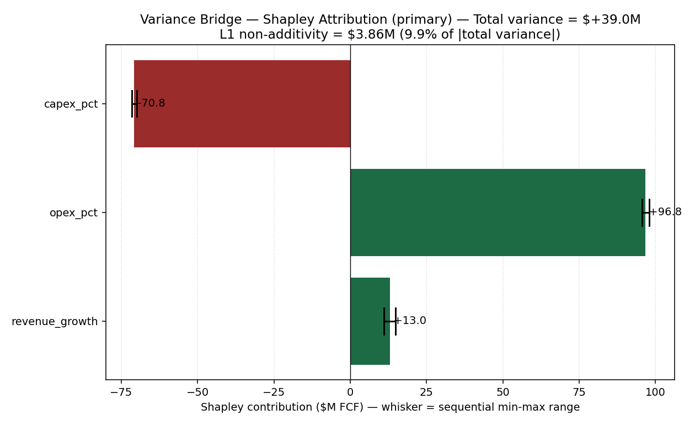

# Bridgework — Phases 1–6

> **Phase 0** (proof of concept) asked one question: *does a Shapley-based
> variance bridge produce enough analytical value to justify building
> around it?* Verdict: **MODIFY** — yes, with two changes. **Phase 1**
> implements those changes as a hardened, tested engine. **Phase 2** adds
> the two remaining analytical modules — DIA (sensitivity) and TBA
> (thresholds). **Phase 3** adds a self-contained HTML report a
> non-technical reader can act on. **Phase 4** proves the schema
> generalises across three companies with zero engine changes. **Phase 6**
> extends attribution from cash flow to *valuation* — the DCF case, where
> the problem bites hardest. Built per the *Bridgework — Master Research
> & Architecture Blueprint v1.0*.

## What this is

A deterministic diagnostic layer that answers, for a controlled financial
model: **why did the primary output change between two versions, and how
much should you trust that explanation?**

The core problem: when analysts explain a number change driver-by-driver
in Excel, the order they walk through the drivers secretly changes the
answer. On this repo's own Zoom fixture, `revenue_growth`'s credited
impact swings from +$11.06M to +$14.92M depending purely on walk order —
with zero change to the underlying economics.

Bridgework fixes this with an exact Shapley decomposition (order-independent,
reconciles to the total variance by construction) reported as the primary
number, with the sequential bridge kept only as a diagnostic showing how
wrong the naive approach would have been.



*Bars are the order-independent Shapley figure. Black whiskers show the full
range a sequential walk could have produced — the ambiguity the bars remove.*

> **New here? Read [`docs/WORKED_EXAMPLE.md`](docs/WORKED_EXAMPLE.md) first.**
> One variance walked end to end, no code and no game theory — what the
> problem looks like on a real forecast, and what you'd say to a CFO.

**See it without running anything:** [`examples/zoom/report.md`](examples/zoom/report.md)
renders directly on GitHub. Download [`examples/zoom/report.html`](examples/zoom/report.html)
for the full designed workpaper (charts embedded, opens offline).
Also: [Caterpillar](examples/caterpillar/report.md) ·
[Northwind](examples/northwind/report.md).

## Quickstart

**What you supply: seven driver values per version — not filings.** If you
have ordinary line items instead of ratios, `bridgework derive` does the
arithmetic and writes the driver files, showing its working:

```bash
bridgework derive --template lines_v1.yaml   # blank form to fill in
bridgework derive lines_v1.yaml lines_v2.yaml
bridgework compare v1_drivers.yaml v2_drivers.yaml --full
```

`derive` is arithmetic only. **It does not read 10-Ks, annual reports, PDFs
or XBRL**, and that is deliberate: deciding what belongs in "operating
expense" is a judgement an analyst must own, and automating it would need
either an LLM inside the calculation path — destroying the determinism and
auditability this project rests on — or brittle heuristics that fail
silently. You decide what the numbers mean; the tool does the division and
shows you the arithmetic.

```bash
pip install -r requirements.txt
pip install -e .

# Phase 1: variance bridge only
bridgework compare data/illustrative/zoom_v1_drivers.yaml data/illustrative/zoom_v2_drivers.yaml

# Phases 1+2: adds sensitivity (DIA) and threshold (TBA) analysis
bridgework compare data/illustrative/zoom_v1_drivers.yaml data/illustrative/zoom_v2_drivers.yaml --full

# A different company entirely — same engine, no code changes
bridgework compare data/caterpillar/cat_v1_drivers.yaml data/caterpillar/cat_v2_drivers.yaml --full

# A different question entirely — why did the price target move?
bridgework compare data/dcf_valuation/target_v1_drivers.yaml data/dcf_valuation/target_v2_drivers.yaml --full

pytest tests/ -v      # 179 passed
```

Outputs land in `outputs/` (CSVs, PNGs, `report.md`, and **`report.html`** —
a single self-contained file with charts embedded, designed to be read by
someone who will never open the code) and `models/`
(`zoom_v1.xlsx`, `zoom_v2.xlsx` — formula-driven, auditable in Excel or
LibreOffice, zero formula errors on recalculation).

You can also feed a hand-edited workbook straight back in:

```bash
bridgework compare data/illustrative/zoom_v1_drivers.yaml models/zoom/v2.xlsx
```

— any change outside the 7 driver cells is rejected with an itemized error
(the Excel contract, see `schema/excel_contract.md`).

## Results (locked, independently re-verified)

| | Value ($M) |
|---|---:|
| V1 FCF | 771.4950 |
| V2 FCF | 810.4530 |
| **Total variance** | **+38.9580** |

**Shapley attribution (primary):**

| Driver | Shapley ($M) | % of variance |
|---|---:|---:|
| revenue_growth | +12.99 | 33% |
| opex_pct | +96.79 | 248% |
| capex_pct | −70.82 | −182% |

**Non-additivity:** net +$0.60M (partially cancels — not the recommended
risk metric), **L1 $3.86M** (never cancels — the correct model-risk
diagnostic; see `docs/methodology.md`).

## Architecture

```
bridgework/
├── schema/                    Canonical driver taxonomy + Excel contract
├── data/
│   ├── illustrative/           Zoom — canonical-named driver files
│   ├── caterpillar/            CAT — company adapter + native-named drivers
│   ├── synthetic_retail/       Northwind — the mapping-only proof case
│   └── dcf_valuation/          Synthetic DCF — valuation attribution
├── models/                    Generated Excel workbooks (byproduct, not source of truth)
├── src/bridgework/
│   ├── model.py                Canonical calc — Drivers dataclass, compute_fcf
│   ├── ingestion.py             YAML loading + Excel generation + constrained round-trip
│   ├── sia.py                   7 structural checks + 1 reserved (regression gate)
│   ├── variance_bridge.py       Sequential (diagnostic) + Shapley exact/Monte-Carlo (primary)
│   ├── interactions.py          Pairwise interactions, net/L1 non-additivity
│   ├── derive.py                Phase 7 — line items → drivers (arithmetic, not extraction)
│   ├── dcf.py                   Phase 6 — DCF valuation model (implied share price)
│   ├── model_spec.py            Phase 6 — model registry (fcf | dcf)
│   ├── dia.py                   Phase 2 — tornado, Sobol, Morris sensitivity
│   ├── tba.py                   Phase 2 — threshold analysis + monotonicity guard
│   ├── audit.py                 Run manifest — input hash, code version, timestamp
│   ├── report.py                Deterministic executive summary + full markdown report
│   ├── plots.py                 IBCS/ISO-24896-aligned charts
│   ├── html_report.py           Phase 3 — self-contained HTML workpaper
│   └── cli.py                   `bridgework compare` entry point
├── tests/                      179 tests: axioms, ingestion, SIA, DIA, TBA, DCF, HTML, cross-company, golden regression, edge cases
└── docs/                       methodology, decision diary, limitations, Phase 0 findings
```

| Document | What it covers |
|---|---|
| [`docs/WORKED_EXAMPLE.md`](docs/WORKED_EXAMPLE.md) | **Start here.** One variance end to end, in plain language |
| [`docs/BLUEPRINT.md`](docs/BLUEPRINT.md) | The governing architecture spec this was built from |
| [`docs/methodology.md`](docs/methodology.md) | The maths: Shapley, interaction indices, Sobol, threshold guards |
| [`docs/decision_diary.md`](docs/decision_diary.md) | Every non-trivial choice, with options considered and trade-offs |
| [`docs/limitations.md`](docs/limitations.md) | What this does *not* do — read before trusting output |
| [`docs/ADVERSARIAL_REVIEW.md`](docs/ADVERSARIAL_REVIEW.md) | Twelve challenges to this work, answered with evidence — including two bugs it found |
| [`docs/PAPER.md`](docs/PAPER.md) | Technical report: method, results, validation |
| [`docs/phase_0_findings.md`](docs/phase_0_findings.md) | The proof-of-concept that justified building it |

## Why DIA exists alongside Shapley

They answer different questions, and the difference is not academic. On
this repo's own fixture, `cogs_pct` **never changed** between V1 and V2 —
so Shapley correctly assigns it nothing. Yet DIA shows it is the
**second-largest driver of output uncertainty** (Sobol ST ≈ 0.17). An
analyst reading only the variance bridge would not know that.

- **Shapley** — retrospective: attributes a *realized* change. "Who caused
  what already happened?"
- **DIA/Sobol** — prospective: attributes *variance* under an assumed
  input distribution. "What should I worry about next?"

## How far does the schema actually generalise?

Three companies, three deliberately different economic shapes, one engine.
Note precisely what this shows: **vocabulary and parameter generalisation
within a fixed model form**, not that the seven-driver equation suits any
business. It does not — see the bank case in
[`docs/ADVERSARIAL_REVIEW.md`](docs/ADVERSARIAL_REVIEW.md), which the tool
accepts without complaint and should not.

| | Gross margin | CapEx intensity | Working capital |
|---|---:|---:|---:|
| Zoom — software | ~76% | 3.0% | positive |
| Caterpillar — heavy industry | ~38% | 5.0% | positive |
| Northwind — retail *(synthetic)* | ~26% | 2.0% | **negative** |

Each writes its driver files in its own vocabulary (CAT reports "sales and
revenues" and "cost of sales", not "revenue" and "COGS") and binds them to
canonical roles through a `mapping.yaml` adapter.

**The mapping-only rule, tested honestly.** Building the mapping mechanism
was itself a one-time change to `ingestion.py` — the rule can't be met by
a codebase with no mapping layer. So: the mechanism landed with
Caterpillar, that state was committed, then a *third* company was added
and verified with `git status --porcelain src/`, which returned empty.
Three YAML files, zero source changes.

## Where the problem bites hardest: valuation

The same engine, pointed at a DCF instead of a cash-flow model. Terminal
value is `FCF₅ × (1+g) / (WACC − g)`, so WACC and terminal growth interact
through a *difference in a denominator* — violently non-linear where the
FCF model is nearly bilinear:

| | Zoom FCF | DCF valuation |
|---|---:|---:|
| L1 non-additivity | 9.9% of change | **24.9% of change** |
| Dominant interacting pair | revenue × opex | **WACC × terminal growth** |
| Widest sequential ordering range | $3.86M on a $38.96M move | **$8.12/share on a $45.11 move** |

On a stock priced near $110, walking the drivers in a different order
changes WACC's credited impact by $8.12 per share. See
[`examples/dcf/report.md`](examples/dcf/report.md).

The DCF also needed a guard the FCF model didn't: Shapley evaluates every
*coalition*, so a mix of V1's WACC with V2's terminal growth can give
`WACC ≤ g` — an undefined model — even when both versions are valid alone.
The engine refuses explicitly rather than returning a negative-denominator
terminal value.

## What this is, stated plainly

**This demonstrates a methodological problem and a defensible fix, on a
controlled model. It is not something a company can deploy.**

The distinction matters and is easy to blur. The *problem* is real and
widespread: variance bridges are everywhere in FP&A, equity research and
diligence, and the walk-order choice genuinely is undisclosed. The *fix* is
correct and proven. But the tool runs on a compact seven-driver model, not
on anyone's actual forty-tab workbook, and the schema does not fit most
real models — it will accept a bank without complaint and produce confident
nonsense.

Getting from here to production use would mean solving model ingestion and
schema fit, which are larger problems than the one this project set out to
address. Read it as a demonstration of method, not as a deployable tool.

## What's honestly not here yet

The DCF model attributes valuation *movement*; it does not demonstrate IB
modelling craft — no debt schedules, no purchase price allocation, no
accretion/dilution, no comps. The DCF dataset is fully synthetic, as is
Northwind — neither's figures may be cited. Caterpillar's
opex ratio is a balancing figure and its tax/NWC/capex values are
illustrative, not filed (see `data/caterpillar/assumptions.md`). DIA's
±20% input distribution and TBA's default search ranges are documented
assumptions, not calibrated facts. Full list: `docs/limitations.md`.

## Design principles (non-negotiable, per the Blueprint)

Finance before technology · determinism before AI (no LLM anywhere in the
calculation path) · reproducibility (no seeds left undocumented, no
wall-clock/network in the calc path) · auditability · evidence before
opinion · controlled scope (no universal Excel interpreter) · no forced
positive conclusions.
